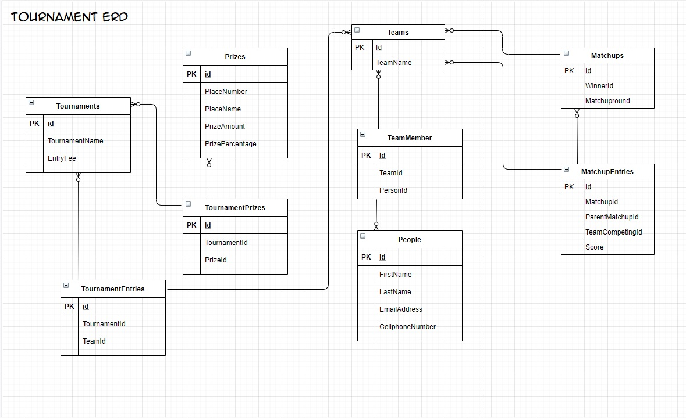
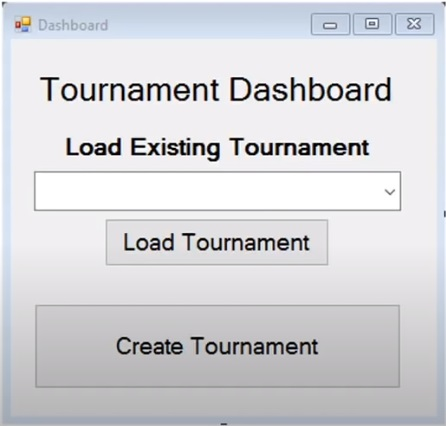
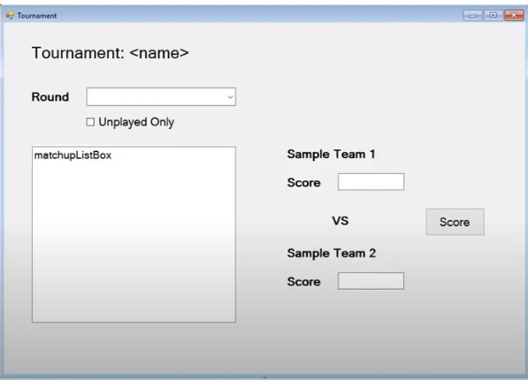
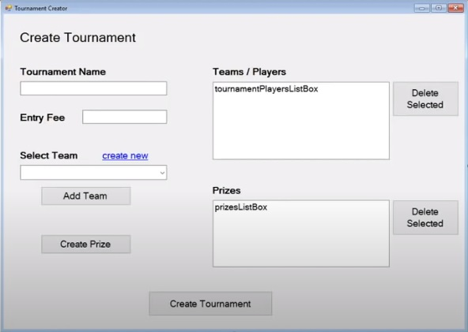
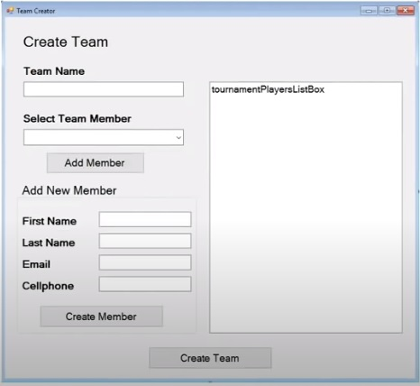
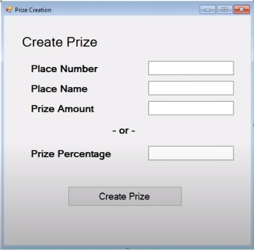

# TournamentTracker

C# Project utilizing MS SQL or TextFile Database

## A application to track friendly tournaments with prizes.

1.	Track games played and their outcome (who won).
2.	Multiple competitors play in the tournament.
3.	Creates a tournament plan (who plays in what order).
4.	Schedule Games.
5.	A single loss eliminates a player.
6.	The last player standing is the winner.

## Structure: Windows Forms application and Class Library
Data: SQL and/or Text File
Users: One at a time on one application
Key concepts:
•	Email
•	SQL
•	Custom Events – game is complete, last game in a round.
•	Interfaces (to easily go back and forth form to form) (switch databases).
•	Random Ordering
•	Send a text would be nice.
•	Error handling

# DATABASE DESIGN

# Tournament Dashboard

# Tournament viewer

# Create Tournament

# Create Team

# Create Prize

